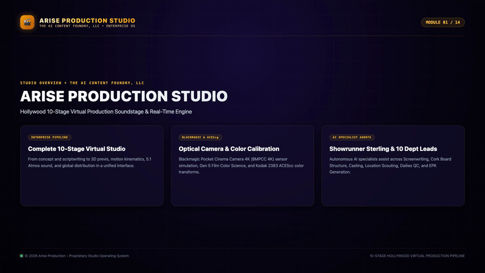

# 🎬 Arise Production Studio

**A PRODUCT OF THE AI CONTENT FOUNDRY, LLC • © 2026 • ALL RIGHTS RESERVED**  
*The Premier 4K 3D Virtual Film & Television Production Studio Suite*

[](https://github.com/FinesseJones/Arise-Productions)
[](./docs/ARCHITECTURE.md)
[](https://build.nvidia.com)
[](http://2.25.113.26:4000)

> 🌐 **Live Interactive Web Studio:** [**http://2.25.113.26:4000**](http://2.25.113.26:4000)  
> *Click above to open and test the full 14-room production studio suite, AI agents, 3D soundstages, and 10 MCP pipelines directly in your browser without installing anything.*

---

## 📺 Master Studio Video Walkthrough & Live Action Demo

Experience the live action studio demonstration recorded directly from the running **Arise Production Studio** soundstage, showing step-by-step navigation, screenplay writing, 3D optical camera solving, and distribution packaging:

[](./docs/assets/arise_studio_walkthrough_demo.mp4)

> 🎬 **[▶️ Click here to Play/Download Full HD 1080p Live Action Demo Video (MP4)](./docs/assets/arise_studio_walkthrough_demo.mp4)**
> 
> 🌐 **[🔗 Open Live Web Studio Instance (2.25.113.26:4000)](http://2.25.113.26:4000)**

### 🧭 14-Module Step-by-Step Studio Guide

| Module | Stage / Room | Key Capabilities & User Actions |
| :--- | :--- | :--- |
| **01** | **Studio Overview** | Enterprise virtual studio engine, Blackmagic Pocket Cinema Camera 4K (BMPCC 4K) optical solvers, ACEScg color science. |
| **02** | **10-Stage Framework** | Real-time stage navigation, interactive 3D soundstage viewports, and stage progress telemetry (🟢 / 🟡 / ⚪). |
| **03** | **00 Idea Lab & Ingest** | Social link ingestion (YouTube/TikTok/IG), script folder batch discovery, and Showrunner Sterling live pitch dissection. |
| **04** | **Stage 01: ScriptBreak** | Full Fountain screenplay editor, real-time pagination, scripture alignment, and AI Script Doctor. |
| **05** | **Stage 02: Cork Board** | 3-Act narrative spine, dynamic beat cards, and NVIDIA NIM Llama 3.1 70B one-click beat generation. |
| **06** | **Stage 03: Master Canvas** | ACEScg AP1 color profiles, lighting contrast ratios (4:1 Key/Shadow), and Unreal Engine 5.4 look-dev calibration. |
| **07** | **Stage 04: Blockout 3D** | Physical BMPCC 4K sensor simulation, 24–85mm prime lens trajectories, and DaVinci Resolve / Unreal Live Link bridges. |
| **08** | **Stage 05: Motion Previs** | 52-point skeletal kinematics, ragdoll physics solvers, velocity damping, and 60 FPS keyframe interpolation. |
| **09** | **Stage 06: Diffusion Slate** | Continuity-locked prompt packs for Midjourney v6, FLUX.1 Pro, SDXL Turbo, and HyperFrames. |
| **10** | **Stage 07: Dailies QC** | Quality Gate scoring (1.0–10.0), likeness locking, circle take selection, and micro-jitter artifact analysis. |
| **11** | **Stage 08: Stem Studio** | 4-track audio stem mixing console, spatial ambient Foley, and EBU R128 -24.0 LKFS broadcast loudness compliance. |
| **12** | **Stage 09: Conform & Edit** | Multi-cam NLE timeline, EDL/XML/FCPXML sync, and real-time Kodak 2383 3D film print LUT shaders. |
| **13** | **Stage 10: Distribution** | Multi-agent timecoded video commentary, Hollywood Electronic Press Kit (EPK), and forensic DRM screeners. |
| **14** | **Enterprise Sync** | 3-Way automated synchronization across GitHub (`Arise-Productions`), Desktop App (`/Applications`), and Cloud VPS (`2.25.113.26`). |

---

## 🏛️ Executive Studio Overview

**Arise Production Studio** is a unified, end-to-end virtual production workstation and multi-agent creative studio designed for independent filmmakers, showrunners, and production companies. It integrates **14 dedicated creative rooms**, **10 Model Context Protocol (MCP) production microservices**, **13 autonomous tool-calling departmental AI agents**, a real-time **Three.js 3D Soundstage**, and native bridges for **Unreal Engine 5**, **ComfyUI**, **FFmpeg**, **Hyperframes**, **OpenMontage**, and **DaVinci Resolve**.

* 📑 **[Master Systems Paper Trail & Architectural Audit →](./docs/STUDIO_SYSTEMS_PAPER_TRAIL.md)** *(Complete technical audit of all 14 rooms, 13 agents, 10 MCPs, Asset Vault, and Relay protocol)*
* 📘 **[Master Operational Manual →](./docs/INSTRUCTIONS.md)**
* 🏗️ **[System Architecture & Data Flows →](./docs/ARCHITECTURE.md)**

---

## 🌟 Key Features & Systems

### 💡 1. 00: Idea Lab & IP Concept Vault
A dedicated incubation suite for pitching, developing, and categorizing story concepts with format-separated database tracking:
* ⚡ **Short-Form Cinema:** 5–15 min festival pieces, viral cinematic reels, and high-impact proof-of-concepts.
* 🎬 **Feature Films:** 3-Act 90–120 min cinematic narratives, indie films, and tentpole screenplays.
* 📺 **TV & Episodic Series:** Multi-season story engines, pilot episode setups, and season cliffhanger bibles.
* 🎯 **Real-Time Pitch Architect:** AI-assisted generators for High-Concept Hooks, Cinematic Loglines, Thematic Engines, Season/Act Blueprints, and Market Comparisons.
* 🚀 **One-Click Promotion:** Convert any approved concept directly into an active project with a 10-stage manifest and default scene script.

---

### 🤖 2. Autonomous Tool-Calling Multi-Agent Boardroom
Unlike chat-only chatbots, Arise Production agents are autonomous **tool-calling systems** capable of inspecting database scripts, modifying project manifests, executing MCP pipeline stages, and coordinating cross-room handoffs:

| Agent | Department | Role & Specialization |
| :--- | :--- | :--- |
| **💡 Orion Vance** | **Development & IP** | **IP Architect & Idea Catalyst Lead:** High-concept hooks, franchise lore, cross-format adaptation. |
| **📺 Scribe Vance** | **Television & Series** | **Episodic TV Series Architect:** Multi-season story engines, pilot cold opens, B-story balance. |
| **⚡ Flash Nova** | **Short Form Cinema** | **Short-Form Specialist:** 5–15 min festival pacing, proof-of-concept reels, vertical cinema. |
| **🌟 Showrunner Sterling** | **Executive Boardroom** | **Studio Lead & Executive Producer:** Series bibles, 40-beat sheets, production greenlights. |
| **✍️ Devon Wells** | **Writing & Narrative** | **Head Screenwriter & Script Doctor:** Fountain screenplay syntax, subtext, dialogue polish. |
| **🎬 CineDirector Maya** | **Direction & Camera** | **Director of Photography & DP:** 18–85mm prime lenses, Unreal CineCamera tracking, rack focus. |
| **💡 Lux Sterling** | **Lighting & Atmosphere** | **Chief Lighting Technician & Master Gaffer:** 3-point Kelvin lighting, volumetric haze, contrast ratios. |
| **🎨 Architect Vance** | **Art & LookDev** | **Production Designer:** ACEScg color palettes, PBR material roughness, spatial set aesthetics. |
| **⚡ Kinetics Kai** | **Animation & Kinematics** | **Kinematics Specialist:** 52-point skeletal tracking, Chaos cloth dynamics, physical weight transfer. |
| **⚡ Synthetix Nova** | **Prompt & VFX** | **Prompt Architect:** FLUX/SDXL negative shields, IP-Adapter face likeness locks, ControlNet depth. |
| **🎞️ Colorist Cole** | **Post & Finishing** | **Finishing Colorist & Editor:** ACEScc color science, Kodak 2383 35mm film print emulation, CDL wheels. |
| **🎧 Acoustic Axel** | **Audio & Sound** | **Sound Supervisor:** 5.1 Dolby Atmos surround sound, AI stem separation, Foley cue sheets. |

---

### 🎥 3. True Cinematic Realism vs. Generic "AI Video"
Arise replaces random prompt guessing with **physical Hollywood cinematography stages**:
1. **Spatial Camera Lock (Stage 4 / Three.js & Unreal Engine):** Real 35mm optical geometry and physical dolly/crane paths prevent random AI camera drift.
2. **Identity & Depth Shield (Stage 7 / ComfyUI & IP-Adapter):** ControlNet depth maps + face vector locks ensure actors never morph between cuts.
3. **DaVinci Resolve ACEScc & Kodak 2383 CDL (Stage 10):** Authentic 35mm film grain, 24.000 FPS motion cadence, and highlight compression deliver true movie aesthetic.

---

### ⚙️ 4. The 10 Production MCP Microservices

```
 ┌──────────────┐     ┌──────────────┐     ┌──────────────┐     ┌──────────────┐     ┌──────────────┐
 │   Stage 01   │     │   Stage 02   │     │   Stage 03   │     │   Stage 04   │     │   Stage 05   │
 │ ScriptBreak  ├────►│  Cork Board  ├────►│Master Canvas ├────►│ Blockout 3D  ├────►│ Motion Previs│
 │ (/mcp/script)│     │(/mcp/struct) │     │ (/mcp/plan)  │     │(/mcp/previs) │     │(/mcp/motion) │
 └──────────────┘     └──────────────┘     └──────────────┘     └──────┬───────┘     └──────────────┘
                                                                       │
 ┌──────────────┐     ┌──────────────┐     ┌──────────────┐     ┌──────▼───────┐     ┌──────────────┐
 │   Stage 10   │     │   Stage 09   │     │   Stage 08   │     │   Stage 07   │     │   Stage 06   │
 │ DaVinci MCP  │◄────┤ Stem Studio  │◄────┤ Circle Take  │◄────┤ Slate Prompt │◄────┤Storyboard Lab│
 │  (/mcp/edit) │     │ (/mcp/sound) │     │(/mcp/dailies)│     │(/mcp/prompt) │     │(/mcp/boards) │
 └──────────────┘     └──────────────┘     └──────────────┘     └──────────────┘     └──────────────┘
```

1. **Stage 1 (ScriptBreak):** Screenplay parser, Fountain element tagger, character dialogue tracker.
2. **Stage 2 (Cork Board):** 3-Act narrative index cards, Save-the-Cat 40-beat structures.
3. **Stage 3 (Master Canvas):** ACEScg color swatches, PBR material roughness, asset manifests.
4. **Stage 4 (Blockout 3D):** Unreal Engine 5 CineCamera bridge (`:30010`), 35mm/85mm optical vectors.
5. **Stage 5 (Motion Previs):** Hyperframes 60 FPS keyframe interpolation and 3D transition blocks.
6. **Stage 6 (Storyboard Lab):** 4-Panel visual storyboards, aspect ratio framing (`2.39:1`, `16:9`, `9:16`).
7. **Stage 7 (Slate Prompt):** ComfyUI (`:8188`) FLUX.1 Dev prompt matrix, IP-Adapter face lock, ControlNet depth.
8. **Stage 8 (Circle Take):** Remotion programmatic compositor, automated take scoring, continuity tracking.
9. **Stage 9 (Stem Studio):** Dolby Atmos 5.1 4-track stem mixing console, AI dialogue cleanup.
10. **Stage 10 (DaVinci MCP):** CMX 3600 EDL timeline assembler, ACEScc Kodak 2383 LUTs, 24.000 FPS export.

---

## 🚀 Quick Start & Installation

### Option 1: Native macOS Desktop Application
* Open `/Applications/Arise Production.app`
* The desktop application runs standalone with bundled backend, local WebSocket gateway, and custom dock branding.

### Option 2: Run from Source
```bash
# Clone the repository
git clone https://github.com/FinesseJones/Arise-Productions.git
cd Arise-Productions

# Install dependencies across root, frontend, and desktop
npm run install:all

# Start Studio Backend & API Gateway (:4000)
npm run server

# Start Frontend Client (:5055)
npm run dev
```

---

## 🔄 3-Way Continuous Synchronization

The studio includes a master synchronization utility (`./scripts/sync-all.sh`) that synchronizes all three deployment targets in a single atomic command:

```bash
./scripts/sync-all.sh "Your commit message here"
```

1. **GitHub Repository:** Pushes current branch (`tool-calling-agents` or `main`) to [GitHub](https://github.com/FinesseJones/Arise-Productions).
2. **macOS Desktop App:** Recompiles frontend, builds Electron app bundle, applies ad-hoc codesigning (`codesign --force --deep --sign -`), and refreshes `/Applications/Arise Production.app` and Desktop DMG.
3. **VPS Server:** Synchronizes remote web deployment at `http://2.25.113.26:4000`.

---

## ⚖️ Legal & Copyright
**© 2026 Arise Production. A product of THE AI CONTENT FOUNDRY, LLC. All rights reserved.**  
This repository and its codebase are proprietary and unlicensed for unauthorized distribution without explicit written consent from THE AI CONTENT FOUNDRY, LLC.
