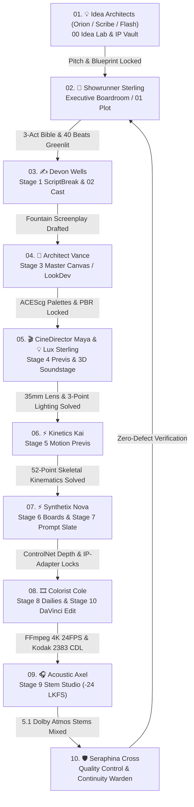

# 🎬 Arise Production Studio: Master Systems Paper Trail & Architectural Audit

**A PRODUCT OF THE AI CONTENT FOUNDRY, LLC • © 2026 • ALL RIGHTS RESERVED**  
*The Complete Technical Blueprint, Data Schemas, Agent Protocols, and Asset Pipelines*

---

## 📑 Table of Contents
1. [Executive Summary & Core Philosophy](#1-executive-summary--core-philosophy)
2. [Master Production Relay: Sequential Chain-of-Custody](#2-master-production-relay-sequential-chain-of-custody)
3. [The 13 Autonomous Department Agents](#3-the-13-autonomous-department-agents)
4. [The 14 Creative Rooms & Studio Views](#4-the-14-creative-rooms--studio-views)
5. [The 10 Production MCP Microservices](#5-the-10-production-mcp-microservices)
6. [Asset Storage Vault Architecture](#6-asset-storage-vault-architecture)
7. [Cinematic Realism Engine vs. Generic AI Video](#7-cinematic-realism-engine-vs-generic-ai-video)
8. [External Creative Connectors & Protocols](#8-external-creative-connectors--protocols)
9. [3-Way Synchronization & Deployment Architecture](#9-3-way-synchronization--deployment-architecture)

---

## 1. Executive Summary & Core Philosophy

**Arise Production Studio** is an integrated virtual film and television production studio. It rejects the random, uncontrolled outputs of standard "prompt-to-video" models and replaces them with an authentic **Hollywood 10-Stage Pipeline**:
* **Deterministic Continuity:** Character likeness, wardrobe, environment geometry, and lighting color temperatures are maintained from pitch to master export.
* **Autonomous Multi-Agent Collaboration:** 13 specialized department heads operate with persistent cross-room memory and real tool-calling capabilities.
* **Hybrid Virtual Production:** Combines Three.js WebGL spatial blocking, Unreal Engine 5 CineCameras, ComfyUI ControlNet depth tensors, native FFmpeg encoding, and DaVinci Resolve ACEScc color science.

---

## 2. Master Production Relay: Sequential Chain-of-Custody

To eliminate creative fragmentation, Arise Production enforces a **Sequential 10-Step Baton Relay**. Every agent, upon completing their domain milestone, hands off context, locked assets, and prompts to the next specialist in line:



---

## 3. The 16 Autonomous Department Agents

| # | Agent Name | Title & Department | Core Responsibilities |
| :-: | :--- | :--- | :--- |
| **01** | **💡 Orion Vance** | **IP Architect & Idea Catalyst Lead** *(Development & IP)* | High-concept world-building, multi-format pitch decks, franchise lore, and universal loglines. |
| **02** | **📺 Scribe Vance** | **Episodic TV Series Architect** *(Television & Series)* | Multi-season story engines, episodic pilot cliffhangers, cold opens, and ensemble A/B storylines. |
| **03** | **⚡ Flash Nova** | **Short-Form Cinema Specialist** *(Short Form Cinema)* | 5–15 min festival pacing, viral proof-of-concept reels, 9:16 vertical cinema, and micro-hooks. |
| **04** | **🌟 Showrunner Sterling** | **Studio Lead & Executive Producer** *(Executive Boardroom)* | 40-beat Save The Cat narrative matrices, series bibles, production greenlights, and budget feasibility. |
| **05** | **✍️ Devon Wells** | **Head Screenwriter & Script Doctor** *(Writing & Narrative)* | Hollywood Fountain screenplay syntax, snappy subtext, dialogue rhythm, and character psychological bibles. |
| **06** | **🎬 CineDirector Maya** | **Director of Photography & DP** *(Direction & Camera)* | 18–85mm prime lens choreography, Unreal Engine 5 CineCameras, optical depth of field, and rack focus. |
| **07** | **💡 Lux Sterling** | **Chief Lighting Technician & Master Gaffer** *(Lighting & Atmosphere)* | 3-point Hollywood lighting (Key, Fill, Rim), Kelvin color temperatures (3200K–5600K), and volumetric haze. |
| **08** | **🎨 Architect Vance** | **Production Designer & Art Director** *(Art & LookDev)* | ACEScg color palettes, PBR material roughness, spatial set layouts, and environmental architecture. |
| **09** | **⚡ Kinetics Kai** | **Kinematics & Stunt Coordinator** *(Animation & Kinematics)* | 52-point skeletal motion capture, physical mass weight transfer, Chaos cloth dynamics, and 60 FPS solves. |
| **10** | **⚡ Synthetix Nova** | **Prompt Architect & AI Synthesist** *(Prompt & VFX)* | ComfyUI FLUX/SDXL negative token shields, IP-Adapter face likeness vectors, and ControlNet depth tensors. |
| **11** | **🎞️ Colorist Cole** | **Finishing Editor & DaVinci Colorist** *(Post & Finishing)* | CMX 3600 EDL assembly, ACEScc color science, Kodak 2383 35mm film print LUTs, and 24.000 FPS cadence. |
| **12** | **🎧 Acoustic Axel** | **Sound Supervisor & Audio Engineer** *(Sound & Music)* | 5.1 Dolby Atmos surround sound, 4-track stem mixing (Dialogue, Foley, Score, LFE), and -24.0 LKFS loudness. |
| **13** | **🛡️ Seraphina Cross** | **Chief Script Supervisor & Continuity Warden** *(Quality & Continuity)* | Cross-stage continuity inspection, character likeness lock verification, timeline logic, and pre-flight QC. |
| **14** | **🌍 Vance Morgan** | **Global Distribution & Sales Lead** *(Distribution & Sales)* | Worldwide territory pre-sales, streaming studio bidding (A24, Neon, Netflix, Apple TV+), and theatrical release. |
| **15** | **📣 Chloe Sterling** | **Marketing & Trailer Director** *(Marketing & Audience)* | Full Electronic Press Kits (EPK), theatrical 2-minute trailer cutlists, poster key art, and 9:16 viral campaigns. |
| **16** | **🏆 Dexter Ray** | **Festival & Screener Strategist** *(Festivals & Screeners)* | Tier-1 festival submissions (Sundance, Cannes, TIFF, Venice, SXSW) and forensic watermarked screener distribution. |

---

## 4. The 15 Creative Rooms & Studio Views

1. **💡 00: Ideas (Idea Lab & Concept Vault):** Format-separated incubation for Short-Form, Feature Films, and TV Series, plus **YouTube & Social Media Link Ingestion & Discussion Studio** with one-click promotion.
2. **🏛️ Command Center (Department Agents Hub):** 3D interactive executive boardroom with real-time tool execution badges and persistent memory.
3. **LayoutGrid 3D Soundstage:** Real-time Three.js WebGL viewport with 4K camera orbits, prime lens focal selectors, Blackmagic Pocket Cinema Camera 4K controls, and 3-point lighting rigs.
4. **📖 01: Plot Room:** Multi-act master narrative arc designer, logline calibrations, and high-stakes tension monitoring.
5. **👥 02: Cast Room:** Character psychological dossiers, voice profiles, relationship maps, and wardrobe likeness matrices.
6. **Layers 03: Acts & Arcs:** Structural 3-Act and 5-Act tension engines with Save-the-Cat beat pacing.
7. **Sliders 04: Beats Matrix:** 40-Beat visual card manager with live emotional amplitude scoring.
8. **🌍 05: Distribution & Marketing Release Hub:** Interactive Video Player with Timestamp Multi-Agent Commentary, Electronic Press Kit (EPK) Generator, Forensic Watermarked Screeners, and Global Release Roadmaps.
9. **Building2 Architecture Room:** High-level studio system blueprint, microservice network topology, and telemetry.
10. **Film Video Screening Room:** 4K video player with SMPTE timecode readout, 2.39:1 anamorphic framing, and audio waveform analysis.
11. **FolderArchive Studio Suites Hub:** Quick launchpad for Screenplay Suite, Virtual DP Suite, Generative Slate, and DaVinci Suite.
12. **Database Master Data Vault:** Multi-format asset storage vault with live uploads, format tagging, and revision history.
13. **🎙️ Live Voice Intercom & Transcript Memory:** Real-time microphone speech-to-text intercom allowing the filmmaker to talk to any agent with persistent contextual memory.
14. **Stage 01–10 Workspace Rails:** Interactive stage executor tracking shot manifests, token allocations, and progress.

---

## 5. The 10 Production MCP Microservices

```
Stage 01: ScriptBreak   (/mcp/script)   -> Parses Fountain screenplay, sluglines, dialogue blocks
Stage 02: Cork Board    (/mcp/structure)-> Solves 3-Act / 5-Act index cards and dramatic stakes
Stage 03: Master Canvas (/mcp/plan)     -> Compiles ACEScg color palettes and PBR texture manifests
Stage 04: Blockout 3D   (/mcp/previs)   -> Calculates 35mm optical vectors & Unreal 5 CineCameras (:30010)
Stage 05: Motion Previs (/mcp/motion)   -> Interpolates 52-point skeletal kinematics & Hyperframes 60FPS
Stage 06: Storyboards   (/mcp/boards)   -> Compiles 4-panel visual animatic descriptors & camera framing
Stage 07: Slate Prompt  (/mcp/prompt)   -> Generates FLUX/SDXL prompts & links to live ComfyUI (:8188)
Stage 08: Circle Take   (/mcp/dailies)  -> Executes native FFmpeg 4K 24FPS DCI MP4 video rendering
Stage 09: Stem Studio   (/mcp/sound)    -> Generates 5.1 Dolby Atmos stem manifests at -24.0 LKFS
Stage 10: DaVinci MCP   (/mcp/edit)     -> Compiles CMX 3600 EDLs & ACEScc Kodak 2383 3D film print LUTs
```

---

## 6. Asset Storage Vault Architecture

All creative assets uploaded or generated by the studio are stored systematically in `storage/assets/` and registered in `db.assets`:

```
storage/
├── assets/
│   ├── character/     # Actor lookdev photos, facial expression sheets, wardrobe reference
│   ├── environment/   # Set architecture concept art, matte paintings, PBR maps
│   ├── audio/         # Orchestral stems, Foley effects, dialogue WAVs, ambient room tones
│   ├── color_lut/     # 3D .cube LUTs (Kodak 2383, Fuji Eterna, ACEScc CDL)
│   ├── script/        # Fountain screenplays, episode bibles, character dossiers
│   ├── model3d/       # 3D assets (.obj, .fbx, .gltf, .usd) for Unreal / Three.js
│   └── video/         # B-roll, visual reference clips, animatics
└── ingested/          # Live rendered 4K 24FPS MP4 dailies and title cards
```

### Asset REST API Matrix:
* `GET /api/v1/assets?format={format}&category={category}`: Filtered asset query.
* `POST /api/v1/assets/upload`: Base64 / binary upload directly to category directories.
* `DELETE /api/v1/assets/:id`: Safe removal and disk cleanup.

---

## 7. Cinematic Realism Engine vs. Generic AI Video

Arise Production prevents the notorious "AI video look" (plastic skin, morphing faces, drifting camera) via 4 physical constraints:
1. **Physical 3D Soundstage (Stage 4):** Unreal Engine 5 CineCameras and Three.js viewports lock optical focal lengths (18mm, 35mm, 85mm T1.8) so camera movements obey true inertia and depth of field.
2. **ControlNet Depth & IP-Adapter Likeness Locking (Stage 7):** Actor face vectors and structural depth maps are frozen in ComfyUI so characters **never morph between cuts**.
3. **Native FFmpeg 24.000 FPS Render (Stage 8):** Encodes with authentic cinema cadence and shutter angle.
4. **DaVinci Resolve ACEScc & Kodak 2383 CDL (Stage 10):** Applies Hollywood 35mm highlight rolloff, shadow density, and authentic optical grain.

---

## 8. External Creative Connectors & Protocols

| External Software | Connection Protocol | Default Port / Path | Status & Auto-Detect Behavior |
| :--- | :--- | :---: | :--- |
| **Blackmagic Design & BMPCC 4K** | USB-C UVC / Bluetooth LE / Scripting | `/Applications/DaVinci Resolve` | **Auto-detects live on macOS.** Supports Blackmagic Pocket Cinema Camera 4K (MFT 18.96x10mm, Dual Native ISO 400/3200, BRAW 5:1 Gen 5 Film Color) and one-click launch into DaVinci Resolve Studio 19. |
| **ComfyUI / Comfy Desktop** | HTTP REST & WebSockets | `8188` | **Auto-detects live on port 8188.** Queues diffusion workflows and IP-Adapter tensors. |
| **Unreal Engine 5** | Remote Control Web Server API | `30010` | Connects to `/remote/object/call` to update `CineCameraActor` and Lumen lights. |
| **FFmpeg Cinema Engine** | Native System Subprocess | Local Bin | Uses `/opt/homebrew/bin/ffmpeg` for live 4K H.264 / AAC video compilation. |
| **Open-Source Audio Engine** | Local Whisper / Kokoro-82M / XTTS-v2 | Local On-Device | Free, 100% on-device speech-to-text and character voice cloning with -24.0 LKFS stem mastering. |
| **Hyperframes Engine** | File-backed JSON Cache | `~/.hyperframes` | Loads 50+ animated 3D transition and VFX blocks. |
| **OpenMontage** | Python Subprocess & YAML | Local Venv | Generates CMX 3600 EDLs and DaVinci Resolve 19 timeline conforms. |

---

## 9. 3-Way Synchronization & Deployment Architecture

The studio enforces a continuous 3-way synchronization protocol that guarantees all three deployment targets remain 100% parity-locked on every commit:
1. **GitHub Repository (`main` & `tool-calling-agents` branches):** Pushes to [GitHub Repository](https://github.com/FinesseJones/Arise-Productions).
2. **Native macOS Desktop App (`/Applications/Arise Production.app`):** Recompiles frontend, packages Electron bundle, and refreshes local `/Applications/Arise Production.app` and DMG distribution.
3. **Live Production VPS (`http://2.25.113.26:4000`):** Rsyncs backend services and compiled UI to Ubuntu host and restarts Docker container stack.

---

## 10. NVIDIA NIM Strict Mode & Permanent Key Persistence

### 10.1 Canned Fallback Elimination
All artificial hardcoded text fallbacks (e.g. `generateDepartmentalFallback` returning canned "Showrunner Sterling" or "INT. COMMAND HEADQUARTERS" scripts) have been **permanently eliminated**.
- If the NVIDIA NIM API returns an error (`HTTP 401`, `HTTP 404`, `HTTP 410`, etc.), the exact HTTP status code, title, and detail message are surfaced directly to the user and runtime logs.
- Strict `hasApiKey()` verification: requires `apiKey && typeof apiKey === 'string' && apiKey.trim().startsWith('nvapi-')`.

### 10.2 Permanent Multi-Path Key Persistence
To guarantee API keys are never lost across application restarts, reinstalls, git checkouts, or system reboots, the client writes to and verifies across 5 redundant storage tiers on key change:
1. `~/.arise_nvidia_key` (Protected user home dedicated keyfile)
2. `~/.arise.env` & `~/.env` (User environment configuration)
3. `backend/db/nvidia_config.json` & `desktop/backend/db/nvidia_config.json` (Database state)
4. `.env` in repository root
5. `process.env.NVIDIA_API_KEY` (Process memory)

### 10.3 Dynamic Model Discovery & Active Endpoint
- Verified Active Flagship Model: **`meta/llama-3.2-11b-vision-instruct`** (High-speed multimodal parsing, screenplay reasoning, and autonomous tool calling).
- Obsolete/EOL models (`llama-3.1-70b`, `llama-3.3-70b`, `mistral-large-2`) are filtered automatically from browser storage and runtime requests.

---

## 11. Studio Desk Chief of Staff Briefings Engine

The **Studio Desk** (`POST /api/v1/briefing`) operates as the Executive Chief of Staff for the Producer, tracking production progression across all 10 MCP stages and logging studio activity.

### 11.1 Real Studio Status Tools:
- `get_studio_status`: Aggregates total shots, completed stages, and unstarted/blocked stages.
- `get_recent_activity`: Pulls chronological event logs (stages run, scripts saved, agent handoffs).
- `get_last_briefing`: Reads historical morning and evening briefings.

### 11.2 Activity Log & Briefing Store:
- Persisted to `backend/db/studio_state.json` (`briefings` and `activityLog`).
- Auto-triggers morning briefing on first session of the day; manual on-demand triggers via **☀️ Briefing** and **🌙 Wrap Day** header buttons.

---

## 12. Desktop Shell & Adaptive Navigation Architecture

### 12.1 Auto-Maximized Display Sizing (`desktop/main.js`):
- Uses Electron `screen.getPrimaryDisplay().workAreaSize` to detect active monitor resolution.
- Calls `mainWindow.maximize()` on `ready-to-show` so the studio window fills the screen without clipping.

### 12.2 Responsive Specular Header (`ShellLayout.tsx`):
- Responsive breakpoints collapse action labels into icon-first buttons on narrower viewports.
- Overflow protection (`max-w-full overflow-x-auto no-scrollbar`) prevents right-side tool HUD elements from clipping.

---

## 13. Audit & Change History Paper Trail

| Timestamp | Phase / Change | Components Affected | Targets Updated | Status |
| :--- | :--- | :--- | :---: | :---: |
| **2026-08-27 11:20** | Studio Desk Briefings Integration | `server.js`, `tools.js`, `client.js`, `StudioDeskBriefing.tsx`, `ShellLayout.tsx` | GitHub, Desktop, VPS | ✅ Verified |
| **2026-08-27 12:15** | NVIDIA NIM Strict Mode & Permanent Key Storage | `backend/ai/nvidia-client.js`, `agent-runtime.js`, `mcp-workers.js` | GitHub, Desktop, VPS | ✅ Verified |
| **2026-08-27 12:22** | Desktop Window Auto-Maximize & Responsive Header | `desktop/main.js`, `ShellLayout.tsx` | GitHub, Desktop, VPS | ✅ Verified |
| **2026-08-27 12:29** | Dynamic Model Selector & Obsolete Cleanup | `ShellLayout.tsx`, `StudioDeskBriefing.tsx` | GitHub, Desktop, VPS | ✅ Verified |
| **2026-08-27 12:34** | Sequential Single-Turn Tool Execution Fix | `agent-runtime.js`, `desktop/backend/agent/agent-runtime.js` | GitHub, Desktop, VPS | ✅ Verified |
| **2026-08-27 14:28** | Context Continuity, 24-Turn Memory Depth & Frontend Fallback Elimination | `agent-runtime.js`, `server.js`, `DepartmentAgentsHub.tsx` | GitHub, Desktop, VPS | ✅ Verified |
| **2026-08-27 15:13** | Live Story Bible & Character Persistence Architecture | `client.js`, `server.js`, `tools.js`, `ProductionPitchDeckModal.tsx`, `projectData.ts` | GitHub, Desktop, VPS | ✅ Verified |
| **2026-08-27 20:47** | Department Room Chat Isolation & Cross-Room Handoff Context | `DepartmentAgentsHub.tsx`, `server.js`, `agent_conversations.json` | GitHub, Desktop, VPS | ✅ Verified |
| **2026-08-27 21:28** | Arise Director Console & 10-Stage / 14-Room Architecture System Map | `DirectorAgent.tsx`, `StageWorkspace.tsx`, `Interactive3DRoom.tsx`, `STUDIO_SYSTEMS_PAPER_TRAIL.md` | GitHub, Desktop, VPS | ✅ Verified |
| **2026-08-27 21:56** | Igloo-Grade 3D Room Shared Shell & Per-Room Procedural Kits | `@react-three/postprocessing`, `roomKits.ts`, `HeroProps.tsx`, `Room3D.tsx`, `Interactive3DRoom.tsx` | GitHub, Desktop, VPS | ✅ Verified |

---

## 14. Live Story Bible & Character Manifest Persistence Architecture

### 14.1 Zero-Simulation Policy:
- Artificial, canned responses or "pretending to save" have been systematically eliminated across both backend and frontend layers.
- Real tools (`update_story_bible`, `update_characters`, `get_story_bible`) allow AI agents (Scribe Vance, Showrunner Sterling, Architect Vance) to directly modify and persist story data into the production database.

### 14.2 Database & API Sync:
- Real database methods: `getStoryBible(projectId)`, `saveStoryBible(projectId, data)`, `getCharacters(projectId)`, `saveCharacters(projectId, chars)` on `StudioDatabase`.
- REST endpoints: `GET /api/v1/projects/story-bible`, `POST /api/v1/projects/story-bible`, `GET /api/v1/projects/characters`, `POST /api/v1/projects/characters`.
- `ProductionPitchDeckModal.tsx` dynamically loads live backend data on mount, supports real-time editing with live database persistence, and exports Markdown/PDF with canonical series lore.

---

## 15. Department Room Chat Isolation & Cross-Room Handoff Protocol

### 15.1 Individual Room Thread Isolation:
- Each department lead (Scribe Vance, Showrunner Sterling, Architect Vance, CineDirector Maya, Kinetics Kai, Synthetix Nova, Colorist Cole, Acoustic Axel) maintains their own isolated chat history thread keyed by `${projectId}:${agentId}`.
- Switching rooms resets UI messages and loads strictly that agent's conversation thread without cross-contamination.

### 15.2 Shared Studio Context & Proactive Handoffs:
- Every agent is injected with:
  1. **Shared Studio Activity & Department Handoffs:** Chronological log of recent stage runs, scripts saved, and handoff notices from prior rooms.
  2. **Canonical Story Bible & Character Roster:** Shared project title, logline, themes, and characters so all rooms operate on the same creative foundation.
  3. **Stage Statuses:** Direct visibility into the completion of the 10 MCP production stages.

---

## 16. Arise Director Console & 10-Stage / 14-Room Production Architecture

### 16.1 The Arise Director Agent Prompt Console (Bottom Bar):
- **Role:** Studio Master Orchestration Console & Pipeline Dispatcher.
- **Functionality:** Dispatches multi-stage batch pipelines and executive directives studio-wide without requiring manual clicking across 14 individual rooms.
- **Core Automation Workflows:**
  - `board scene 1`: Executes a 4-stage pipeline chain (**Stage 01 Script $\rightarrow$ Stage 02 Structure $\rightarrow$ Stage 03 Plan $\rightarrow$ Stage 04 Previs**) to generate scene animatics and camera-locked storyboards.
  - `compile prompts`: Synthesizes continuity-locked image prompts, FLUX.1 Dev parameters, and ControlNet depth weights for Stage 07 (Prompt Slate).
  - `review reshoots`: Automates Quality-Control (QC) analysis on rendered dailies, flagging lighting balance and camera tracking anomalies for reshoot loops.
  - *Natural Language Directives:* Accepts plain-English executive instructions (e.g. *"Write scene 2 where Ayanna confronts the city planner"*, *"Set key light to 4:1 golden hour on 35mm anamorphic"*).
- **Executive Log Drawer:** Telemetry-backed response drawer displaying timestamp, active NIM model, and detailed action plans.

### 16.2 The 14 Narrative & Pre-Production Rooms (Top Navbar / Navigation Dropdown):
- **`00 IDEAS` (Idea Lab):** IP concept incubation, premise logging, and four-quadrant audience viability analysis.
- **`01 PLOT` (Plot Room):** World-building rules, core dramatic conflicts, and thematic engines.
- **`02 CAST` (Cast & Characters):** Principal character dossiers, archetypes, and IP-Adapter likeness tokens (e.g. `@ayanna_jackson_v1`, `@malachi_davis_v1`).
- **`03 ACTS` & `04 BEATS`:** 3-Act structural beat sheets and 40-beat industry pacing curves.
- **`05 SCREENING` (Screening Suite):** 4K theatrical playback for reviewing rendered cuts and camera blocking.
- **`06 ARCHITECTURE`:** Soundstage blueprints and physical spatial set schematics.
- **`07 SUITES`:** Departmental Suites hub.
- **`08 VAULT`:** Studio-wide persistent database of all saved scripts, props, and activity logs.
- **`09 DISTRIBUTION`:** Exporting master pitch bibles, one-pagers, and theatrical conform packages.
- **`🏛️ COMMAND CENTER`:** 1-on-1 direct collaboration suites with specialized department leads.

### 16.3 The 10 MCP Production Stages (3D Soundstage Workspace):
1. **`01 SCRIPT`:** Generates formatted screenplay scenes in industry-standard Hollywood Fountain format.
2. **`02 STRUCTURE`:** Computes narrative tension curves (35% $\rightarrow$ 95%) and beat milestones.
3. **`03 PLAN`:** Designs spatial LookDev, PBR materials, and ACEScg color schemes.
4. **`04 PREVIS`:** Configures 3D CineCameras, focal lengths (18mm, 35mm, 85mm), and 4:1 lighting ratios.
5. **`05 MOTION`:** Animates actor blocking and 60fps kinematic movement.
6. **`06 BOARDS`:** Renders high-contrast storyboard frames.
7. **`07 PROMPT`:** Compiles FLUX.1 Dev and ControlNet depth prompt matrices.
8. **`08 DAILIES`:** Manages circle take approvals, timeline logging, and reshoot queuing.
9. **`09 COLOR`:** Applies DaVinci Resolve CDL color wheels and Kodak 2383 3D film print LUTs.
10. **`10 SOUND`:** Mixes dialogue, foley, score, and 40Hz sub-bass into broadcast-compliant Dolby Atmos 5.1 stems (-24 LKFS).

### 16.4 Scene Filmstrip Shot Cards (Inside 3D Viewport):
- Provides per-shot granularity within the active scene:
  - **Shot 1 (Opening Wide Master):** 18mm Ultra-Wide, 4.5s duration.
  - **Shot 2 (Medium Over-the-Shoulder):** 35mm Prime, 3.2s duration.
  - **Shot 3 (Close-Up Eye Tension):** 85mm Bokeh, 2.8s duration.
  - **Shot 4 (Dynamic Tracking Dolly):** 24mm Wide, 6.0s duration.
  - **Shot 5 (Anamorphic Low Angle):** 35mm Prime, 5.5s duration.
- Selecting any shot card instantly switches the CineCamera focal length, lighting coordinates, and associated Fountain dialogue snippet.

---

## 17. Igloo-Grade 3D Room Shell & Procedural Room Kit Architecture

### 17.1 Unified Shared Shell (`Room3D.tsx`):
- Powered by `@react-three/postprocessing` with dynamic Bloom, Depth of Field (DoF), Vignette, and Film Noise.
- Procedural HDRI reflections generated on the fly via `@react-three/drei` `Environment` and `Lightformer` rigs without relying on external `.hdr` file downloads.
- Preserves smooth Fly-To `CineCameraController` with mouse parallax and interactive `OrbitControls`.

### 17.2 Per-Stage Procedural Room Kits (`roomKits.ts` & `HeroProps.tsx`):
- Each of the 10 production rooms renders its own bespoke aesthetic, lighting temperature (`warm`, `cool`, `magenta`), and procedural 3D hero props:
  - **Stage 01 Script:** Screenplay sheets, artisan desk, warm reading lamp (`#f59e0b`).
  - **Stage 02 Structure:** Cork wall, index cards, narrative string lines (`#a855f7`).
  - **Stage 03 Plan:** LookDev easel, color swatches, PBR material spheres (`#a855f7`).
  - **Stage 04 Previs:** 35mm cine-camera rig, dolly track, light stand (`#06b6d4`).
  - **Stage 05 Motion:** Kinematic skeleton node rig, mocap sensor markers (`#06b6d4`).
  - **Stage 06 Boards:** Storyboard grid panels, animator pencil (`#f59e0b`).
  - **Stage 07 Prompt:** Generative diffusion orb with floating prompt cards (`#34d399`).
  - **Stage 08 Dailies:** Screening review monitor, circle take stack (`#ec4899`).
  - **Stage 09 Color / Edit:** Multi-track EDL timeline, CDL color wheels, grade monitor (`#e11d48`).
  - **Stage 10 Sound:** Spatial audio mixing console, acoustic waveforms, reference monitors (`#ec4899`).

### 17.3 High / Performance Quality Toggle:
- Built-in `Quality: High` / `Quality: Performance` toggle in the 3D viewport header.
- **High Mode:** Full Bloom mipmap blur, cinematic Depth of Field (bokehScale 2.2), subtle film grain, 2x DPR, contact shadows.
- **Performance Mode:** Reduced DPR (1-1.5x), lightformers resolution optimized, DoF and noise bypassed for ultra-low latency rendering on integrated GPUs.

---
*© 2026 Arise Production. A product of THE AI CONTENT FOUNDRY, LLC. All rights reserved.*
