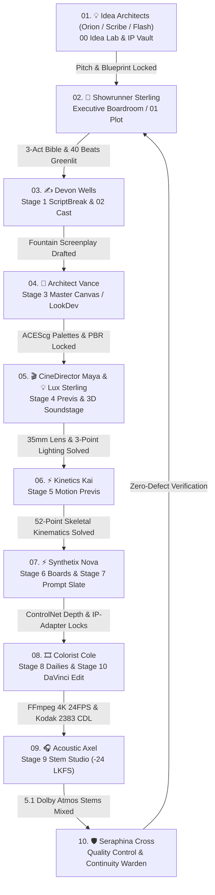

# 🎬 Arise Production Studio: Master Systems Paper Trail & Architectural Audit

**A PRODUCT OF THE AI CONTENT FOUNDRY, LLC • © 2026 • ALL RIGHTS RESERVED**  
*The Complete Technical Blueprint, Data Schemas, Agent Protocols, and Asset Pipelines*

---

## 📑 Table of Contents
1. [Executive Summary & Core Philosophy](#1-executive-summary--core-philosophy)
2. [Master Production Relay: Sequential Chain-of-Custody](#2-master-production-relay-sequential-chain-of-custody)
3. [The 13 Autonomous Department Agents](#3-the-13-autonomous-department-agents)
4. [The 14 Creative Rooms & Studio Views](#4-the-14-creative-rooms--studio-views)
5. [The 10 Production MCP Microservices](#5-the-10-production-mcp-microservices)
6. [Asset Storage Vault Architecture](#6-asset-storage-vault-architecture)
7. [Cinematic Realism Engine vs. Generic AI Video](#7-cinematic-realism-engine-vs-generic-ai-video)
8. [External Creative Connectors & Protocols](#8-external-creative-connectors--protocols)
9. [3-Way Synchronization & Deployment Architecture](#9-3-way-synchronization--deployment-architecture)

---

## 1. Executive Summary & Core Philosophy

**Arise Production Studio** is an integrated virtual film and television production studio. It rejects the random, uncontrolled outputs of standard "prompt-to-video" models and replaces them with an authentic **Hollywood 10-Stage Pipeline**:
* **Deterministic Continuity:** Character likeness, wardrobe, environment geometry, and lighting color temperatures are maintained from pitch to master export.
* **Autonomous Multi-Agent Collaboration:** 13 specialized department heads operate with persistent cross-room memory and real tool-calling capabilities.
* **Hybrid Virtual Production:** Combines Three.js WebGL spatial blocking, Unreal Engine 5 CineCameras, ComfyUI ControlNet depth tensors, native FFmpeg encoding, and DaVinci Resolve ACEScc color science.

---

## 2. Master Production Relay: Sequential Chain-of-Custody

To eliminate creative fragmentation, Arise Production enforces a **Sequential 10-Step Baton Relay**. Every agent, upon completing their domain milestone, hands off context, locked assets, and prompts to the next specialist in line:



---

## 3. The 13 Autonomous Department Agents

| # | Agent Name | Title & Department | Core Responsibilities |
| :-: | :--- | :--- | :--- |
| **01** | **💡 Orion Vance** | **IP Architect & Idea Catalyst Lead** *(Development & IP)* | High-concept world-building, multi-format pitch decks, franchise lore, and universal loglines. |
| **02** | **📺 Scribe Vance** | **Episodic TV Series Architect** *(Television & Series)* | Multi-season story engines, episodic pilot cliffhangers, cold opens, and ensemble A/B storylines. |
| **03** | **⚡ Flash Nova** | **Short-Form Cinema Specialist** *(Short Form Cinema)* | 5–15 min festival pacing, viral proof-of-concept reels, 9:16 vertical cinema, and micro-hooks. |
| **04** | **🌟 Showrunner Sterling** | **Studio Lead & Executive Producer** *(Executive Boardroom)* | 40-beat Save The Cat narrative matrices, series bibles, production greenlights, and budget feasibility. |
| **05** | **✍️ Devon Wells** | **Head Screenwriter & Script Doctor** *(Writing & Narrative)* | Hollywood Fountain screenplay syntax, snappy subtext, dialogue rhythm, and character psychological bibles. |
| **06** | **🎬 CineDirector Maya** | **Director of Photography & DP** *(Direction & Camera)* | 18–85mm prime lens choreography, Unreal Engine 5 CineCameras, optical depth of field, and rack focus. |
| **07** | **💡 Lux Sterling** | **Chief Lighting Technician & Master Gaffer** *(Lighting & Atmosphere)* | 3-point Hollywood lighting (Key, Fill, Rim), Kelvin color temperatures (3200K–5600K), and volumetric haze. |
| **08** | **🎨 Architect Vance** | **Production Designer & Art Director** *(Art & LookDev)* | ACEScg color palettes, PBR material roughness, spatial set layouts, and environmental architecture. |
| **09** | **⚡ Kinetics Kai** | **Kinematics & Stunt Coordinator** *(Animation & Kinematics)* | 52-point skeletal motion capture, physical mass weight transfer, Chaos cloth dynamics, and 60 FPS solves. |
| **10** | **⚡ Synthetix Nova** | **Prompt Architect & AI Synthesist** *(Prompt & VFX)* | ComfyUI FLUX/SDXL negative token shields, IP-Adapter face likeness vectors, and ControlNet depth tensors. |
| **11** | **🎞️ Colorist Cole** | **Finishing Editor & DaVinci Colorist** *(Post & Finishing)* | CMX 3600 EDL assembly, ACEScc color science, Kodak 2383 35mm film print LUTs, and 24.000 FPS cadence. |
| **12** | **🎧 Acoustic Axel** | **Sound Supervisor & Audio Engineer** *(Sound & Music)* | 5.1 Dolby Atmos surround sound, 4-track stem mixing (Dialogue, Foley, Score, LFE), and -24.0 LKFS loudness. |
| **13** | **🛡️ Seraphina Cross** | **Chief Script Supervisor & Continuity Warden** *(Quality & Continuity)* | Cross-stage continuity inspection, character likeness lock verification, timeline logic, and pre-flight QC. |

---

## 4. The 14 Creative Rooms & Studio Views

1. **💡 00: Ideas (Idea Lab & Concept Vault):** Format-separated incubation for Short-Form, Feature Films, and TV Series with one-click promotion to production.
2. **🏛️ Command Center (Department Agents Hub):** 3D interactive executive boardroom with real-time tool execution badges and persistent memory.
3. **LayoutGrid 3D Soundstage:** Real-time Three.js WebGL viewport with 4K camera orbits, prime lens focal selectors, and 3-point lighting rigs.
4. **📖 01: Plot Room:** Multi-act master narrative arc designer, logline calibrations, and high-stakes tension monitoring.
5. **👥 02: Cast Room:** Character psychological dossiers, voice profiles, relationship maps, and wardrobe likeness matrices.
6. **Layers 03: Acts & Arcs:** Structural 3-Act and 5-Act tension engines with Save-the-Cat beat pacing.
7. **Sliders 04: Beats Matrix:** 40-Beat visual card manager with live emotional amplitude scoring.
8. **Building2 Architecture Room:** High-level studio system blueprint, microservice network topology, and telemetry.
9. **Film Video Screening Room:** 4K video player with SMPTE timecode readout, 2.39:1 anamorphic framing, and audio waveform analysis.
10. **FolderArchive Studio Suites Hub:** Quick launchpad for Screenplay Suite, Virtual DP Suite, Generative Slate, and DaVinci Suite.
11. **Database Master Data Vault:** Multi-format asset storage vault with live uploads, format tagging, and revision history.
12. **Stage 01–10 Workspace Rails:** Interactive stage executor tracking shot manifests, token allocations, and progress.

---

## 5. The 10 Production MCP Microservices

```
Stage 01: ScriptBreak   (/mcp/script)   -> Parses Fountain screenplay, sluglines, dialogue blocks
Stage 02: Cork Board    (/mcp/structure)-> Solves 3-Act / 5-Act index cards and dramatic stakes
Stage 03: Master Canvas (/mcp/plan)     -> Compiles ACEScg color palettes and PBR texture manifests
Stage 04: Blockout 3D   (/mcp/previs)   -> Calculates 35mm optical vectors & Unreal 5 CineCameras (:30010)
Stage 05: Motion Previs (/mcp/motion)   -> Interpolates 52-point skeletal kinematics & Hyperframes 60FPS
Stage 06: Storyboards   (/mcp/boards)   -> Compiles 4-panel visual animatic descriptors & camera framing
Stage 07: Slate Prompt  (/mcp/prompt)   -> Generates FLUX/SDXL prompts & links to live ComfyUI (:8188)
Stage 08: Circle Take   (/mcp/dailies)  -> Executes native FFmpeg 4K 24FPS DCI MP4 video rendering
Stage 09: Stem Studio   (/mcp/sound)    -> Generates 5.1 Dolby Atmos stem manifests at -24.0 LKFS
Stage 10: DaVinci MCP   (/mcp/edit)     -> Compiles CMX 3600 EDLs & ACEScc Kodak 2383 3D film print LUTs
```

---

## 6. Asset Storage Vault Architecture

All creative assets uploaded or generated by the studio are stored systematically in `storage/assets/` and registered in `db.assets`:

```
storage/
├── assets/
│   ├── character/     # Actor lookdev photos, facial expression sheets, wardrobe reference
│   ├── environment/   # Set architecture concept art, matte paintings, PBR maps
│   ├── audio/         # Orchestral stems, Foley effects, dialogue WAVs, ambient room tones
│   ├── color_lut/     # 3D .cube LUTs (Kodak 2383, Fuji Eterna, ACEScc CDL)
│   ├── script/        # Fountain screenplays, episode bibles, character dossiers
│   ├── model3d/       # 3D assets (.obj, .fbx, .gltf, .usd) for Unreal / Three.js
│   └── video/         # B-roll, visual reference clips, animatics
└── ingested/          # Live rendered 4K 24FPS MP4 dailies and title cards
```

### Asset REST API Matrix:
* `GET /api/v1/assets?format={format}&category={category}`: Filtered asset query.
* `POST /api/v1/assets/upload`: Base64 / binary upload directly to category directories.
* `DELETE /api/v1/assets/:id`: Safe removal and disk cleanup.

---

## 7. Cinematic Realism Engine vs. Generic AI Video

Arise Production prevents the notorious "AI video look" (plastic skin, morphing faces, drifting camera) via 4 physical constraints:
1. **Physical 3D Soundstage (Stage 4):** Unreal Engine 5 CineCameras and Three.js viewports lock optical focal lengths (18mm, 35mm, 85mm T1.8) so camera movements obey true inertia and depth of field.
2. **ControlNet Depth & IP-Adapter Likeness Locking (Stage 7):** Actor face vectors and structural depth maps are frozen in ComfyUI so characters **never morph between cuts**.
3. **Native FFmpeg 24.000 FPS Render (Stage 8):** Encodes with authentic cinema cadence and shutter angle.
4. **DaVinci Resolve ACEScc & Kodak 2383 CDL (Stage 10):** Applies Hollywood 35mm highlight rolloff, shadow density, and authentic optical grain.

---

## 8. External Creative Connectors & Protocols

| External Software | Connection Protocol | Default Port / Path | Status & Auto-Detect Behavior |
| :--- | :--- | :---: | :--- |
| **Blackmagic Design & BMPCC 4K** | USB-C UVC / Bluetooth LE / Scripting | `/Applications/DaVinci Resolve` | **Auto-detects live on macOS.** Supports Blackmagic Pocket Cinema Camera 4K (MFT 18.96x10mm, Dual Native ISO 400/3200, BRAW 5:1 Gen 5 Film Color) and one-click launch into DaVinci Resolve Studio 19. |
| **ComfyUI / Comfy Desktop** | HTTP REST & WebSockets | `8188` | **Auto-detects live on port 8188.** Queues diffusion workflows and IP-Adapter tensors. |
| **Unreal Engine 5** | Remote Control Web Server API | `30010` | Connects to `/remote/object/call` to update `CineCameraActor` and Lumen lights. |
| **FFmpeg Cinema Engine** | Native System Subprocess | Local Bin | Uses `/opt/homebrew/bin/ffmpeg` for live 4K H.264 / AAC video compilation. |
| **Open-Source Audio Engine** | Local Whisper / Kokoro-82M / XTTS-v2 | Local On-Device | Free, 100% on-device speech-to-text and character voice cloning with -24.0 LKFS stem mastering. |
| **Hyperframes Engine** | File-backed JSON Cache | `~/.hyperframes` | Loads 50+ animated 3D transition and VFX blocks. |
| **OpenMontage** | Python Subprocess & YAML | Local Venv | Generates CMX 3600 EDLs and DaVinci Resolve 19 timeline conforms. |

---

## 9. 3-Way Synchronization & Deployment Architecture

The studio includes a master continuous synchronization utility (`./scripts/sync-all.sh`) that updates all three deployment targets simultaneously:
1. **GitHub Repository:** Pushes current branch (`tool-calling-agents`) to [GitHub](https://github.com/FinesseJones/Arise-Productions).
2. **macOS Desktop App:** Recompiles frontend, packages Electron bundle, signs with ad-hoc certificates, and refreshes `/Applications/Arise Production.app` and Desktop `.dmg`.
3. **Remote VPS:** Mirrors full production stack to `http://2.25.113.26:4000`.

---
*© 2026 Arise Production. A product of THE AI CONTENT FOUNDRY, LLC. All rights reserved.*
